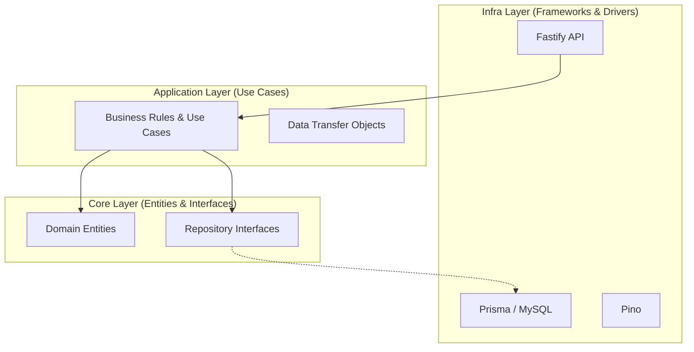
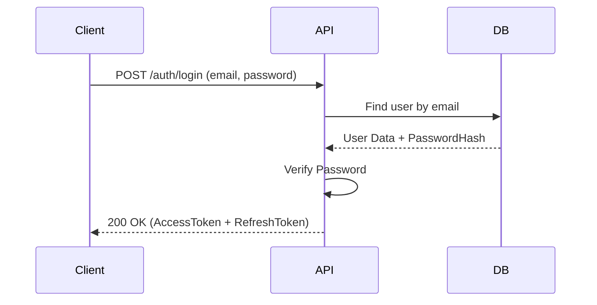

# Orbitra - Multi-tenant Project Management SaaS

[](https://github.com/lucasgabdsant0s/Orbitra/stargazers)
[](https://github.com/lucasgabdsant0s/Orbitra/network/members)
[](LICENSE)
[](https://nodejs.org)
[](https://prisma.io)

Orbitra is a high-performance, multi-tenant project management platform built with **Clean Architecture** and **Domain-Driven Design**. Designed for the 2026 SaaS landscape, it offers strict tenant isolation, scalable database patterns, and a developer-first experience.

---

## Architecture Overview

Orbitra follows the **Clean Architecture** principles to ensure decoupling of business logic from external frameworks and tools.



## Core Features

- **Multi-Tenancy**: Logical data isolation ensuring cross-tenant security. Every request is scoped to a `tenantId`.
- **Clean Architecture**: Domain-centric design for high testability and maintenance.
- **Secure Auth**: JWT with Refresh Tokens, bcrypt hashing, and 2FA support.
- **Project Management**: complete lifecycle for Projects and Tasks with status transitions and priorities.
- **Collaborative**: Invitation-based member management within tenants.
- **Soft Delete**: Data safety first with audit-friendly deletion patterns.
- **Audit Logs**: Comprehensive tracking of all entity changes for compliance and security.

## Tech Stack

| Layer          | Technology                                                                   |
| -------------- | ---------------------------------------------------------------------------- |
| **Runtime**    | [Node.js v20+](https://nodejs.org/)                                          |
| **Language**   | [TypeScript 5+](https://www.typescriptlang.org/)                             |
| **Framework**  | [Fastify v5+](https://fastify.io/)                                           |
| **ORM**        | [Prisma v7+](https://www.prisma.io/)                                         |
| **Database**   | [MySQL 8+](https://www.mysql.com/)                                           |
| **Validation** | [Zod v3+](https://zod.dev/)                                                  |
| **Testing**    | [Jest](https://jestjs.io/) & [Supertest](https://github.com/ladjs/supertest) |

## Automated Tests

Orbitra uses **Jest** and **Supertest** for comprehensive integration testing. Our tests cover the entire vertical slice of the application, from HTTP endpoints down to real database interactions.

### Setup Test Environment

The development environment is pre-configured to handle tests.

```bash
cd backend
npm install
```

### Running Tests

```bash
# Run all tests
npm test

# Run tests in watch mode
npm run test:watch

# Generate coverage report
npm run test:coverage
```

### Test Strategy

Our suites ensure that:

1. **Authentication**: Login, registration, and token refresh work as expected.
2. **Isolation**: Data from `Tenant A` is never visible to `Tenant B`.
3. **Security**: 2FA flows and role-based access control (RBAC) are strictly enforced.
4. **Resilience**: Validation errors and edge cases are gracefully handled.

## Quick Start (Docker)

Get Orbitra up and running in less than 60 seconds:

```bash
# 1. Clone the repository
git clone https://github.com/lucasgabdsant0s/Orbitra.git
cd Orbitra

# 2. Setup environment (minimal config)
cp backend/.env.example backend/.env.development

# 3. Start services
docker compose -f compose.dev.yml up -d --build
```

---

## 🇧🇷 Versão em Português

# Orbitra - SaaS de Gerenciamento de Projetos Multi-tenant

Orbitra é uma plataforma de gerenciamento de projetos multi-tenant de alto desempenho, construída com **Clean Architecture** e **Domain-Driven Design**.

## Arquitetura e Fluxo de Autenticação



## Funcionalidades Principais

- **Multi-Tenancy**: Isolamento lógico de dados via `tenantId`.
- **Clean Architecture**: Separação clara entre regra de negócio e infraestrutura.
- **Segurança**: Suporte nativo a 2FA e Rate Limiting.
- **Gestão de Tarefas**: CRUD completo com suporte a prioridades e comentários.

## Testes Automatizados

Orbitra utiliza uma suíte robusta de testes de integração para garantir a estabilidade do sistema.

```bash
cd backend
npm test
```

A cobertura foca em cenários reais de uso, garantindo que as permissões e o isolamento de dados funcionem perfeitamente.

---

**Built with for the community by [Lucas Santos](https://github.com/lucasgabdsant0s)**
