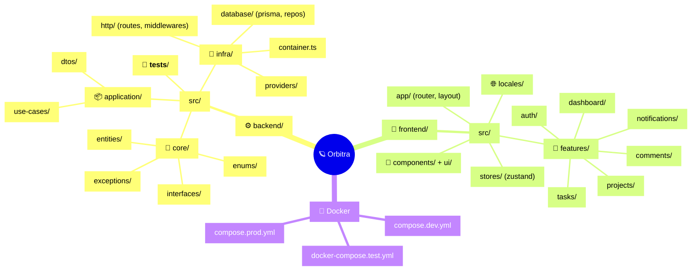
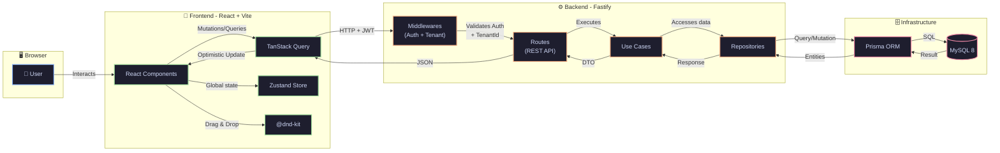

<p align="center">
  <h1 align="center">🪐 Orbitra</h1>
</p>

<p align="center">
  <a href="https://github.com/lucasgabdsant0s/Orbitra/blob/main/LICENSE"></a>
  
  
  
  
  
  
</p>

<p align="center">
  <strong>A modern, scalable, multi-tenant SaaS project management platform.</strong>
</p>

<p align="center">
  <em>Kanban boards, drag & drop, dark mode, Clean Architecture all in one place.</em>
</p>

---

## ✨ Features

|     | Feature                  | Description                                                            |
| --- | ------------------------ | ---------------------------------------------------------------------- |
| 🏢  | **Multi-tenancy**        | Fully isolated organizations and workspaces with tenant-level security |
| 📋  | **Kanban Boards**        | Interactive boards with smooth drag & drop via `@dnd-kit`              |
| ✅  | **Task Management**      | Status, priority, due dates, assignees, and comments                   |
| 🔐  | **JWT Authentication**   | Secure login with Access Token + Refresh Token                         |
| 🏗️  | **Clean Architecture**   | DDD-inspired backend with Use Cases & Dependency Injection             |
| 🎨  | **Premium UI**           | Dark mode, glassmorphism, animations powered by Framer Motion          |
| ⚡  | **Optimistic Updates**   | Instant UX feedback with TanStack Query                                |
| 🌐  | **Internationalization** | Full i18n support (PT-BR / EN)                                         |
| 📊  | **Analytics Dashboard**  | Overview with metrics and charts                                       |
| 🔔  | **Notifications**        | Real-time notification system                                          |
| 🐳  | **Fully Dockerized**     | Complete environment with a single command                             |

---

## 🛠️ Tech Stack

### Backend

`Node.js` • `TypeScript` • `Fastify` • `Prisma ORM` • `MySQL 8` • `Zod` • `JWT` • `Bcrypt` • `Vitest` • `Biome`

### Frontend

`React 19` • `TypeScript` • `Vite` • `Tailwind CSS` • `shadcn/ui` • `Radix UI` • `TanStack Query` • `Zustand` • `Framer Motion` • `@dnd-kit` • `React Hook Form` • `i18next` • `cmdk` • `Sonner` • `Lucide Icons` • `Axios`

### Infrastructure

`Docker` • `Docker Compose` • `Vitest (unit + integration)` • `Scalar (API docs)`

---

## 📂 Folder Structure

```text
orbitra/
├── backend/
│   ├── src/
│   │   ├── core/                    # 🧠 Domain (entities, interfaces, enums)
│   │   │   ├── entities/            # User, Project, Task, Tenant, Comment...
│   │   │   ├── interfaces/          # Repository contracts
│   │   │   ├── enums/               # Domain enumerations
│   │   │   ├── exceptions/          # Custom exceptions
│   │   │   └── types/               # Shared types
│   │   ├── application/             # 📦 Use Cases
│   │   │   ├── use-cases/           # auth, project, task, tenant, user...
│   │   │   └── dtos/                # Data Transfer Objects
│   │   ├── infra/                   # 🔌 Concrete implementations
│   │   │   ├── http/                # Fastify server, routes, middlewares
│   │   │   │   ├── routes/          # REST routes organized by domain
│   │   │   │   ├── middlewares/     # Auth, tenant, rate-limit
│   │   │   │   └── schemas/         # Zod validation schemas
│   │   │   ├── database/            # Prisma client, schema, repositories
│   │   │   │   ├── prisma/          # schema.prisma + migrations
│   │   │   │   └── repositories/    # Prisma repository implementations
│   │   │   ├── providers/           # Hash, Token, etc.
│   │   │   ├── config/              # Application configuration
│   │   │   ├── context/             # Request context
│   │   │   └── container.ts         # 💉 Dependency Injection Container
│   │   ├── shared/                  # Shared utilities
│   │   ├── __tests__/               # 🧪 Unit & integration tests
│   │   ├── server.ts                # Fastify bootstrap
│   │   └── main.ts                  # Entry point
│   ├── vitest.config.ts             # Unit test config
│   ├── vitest.integration.config.ts # Integration test config
│   ├── prisma.config.ts
│   └── package.json
│
├── frontend/
│   ├── src/
│   │   ├── app/                     # 🗂️ Routes and main layout
│   │   │   ├── router.tsx           # React Router config
│   │   │   ├── layout.tsx           # Main layout (Sidebar + Header)
│   │   │   └── routes/              # Route-based pages
│   │   ├── features/                # 🎯 Feature-based modules
│   │   │   ├── auth/                # Login, Register, AuthGuard
│   │   │   ├── projects/            # Project CRUD
│   │   │   ├── tasks/               # Kanban, Task CRUD
│   │   │   ├── dashboard/           # Analytics dashboard
│   │   │   ├── comments/            # Comment system
│   │   │   ├── notifications/       # Notifications
│   │   │   ├── tenants/             # Workspace management
│   │   │   └── settings/            # User settings
│   │   ├── components/              # 🧩 Reusable components
│   │   │   ├── ui/                  # shadcn/ui (Button, Dialog, Input...)
│   │   │   ├── Sidebar.tsx          # Side navigation
│   │   │   ├── Header.tsx           # Header with search + avatar
│   │   │   └── LanguageSwitcher.tsx  # Language selector
│   │   ├── stores/                  # Zustand stores (auth, theme)
│   │   ├── providers/               # React context providers
│   │   ├── locales/                 # 🌐 Translation files (pt, en)
│   │   ├── lib/                     # Axios client, utils
│   │   ├── types/                   # TypeScript interfaces
│   │   └── main.tsx                 # Entry point
│   ├── vite.config.ts
│   ├── tailwind.config.ts
│   ├── Dockerfile
│   └── package.json
│
├── compose.dev.yml                  # 🐳 Docker Compose (development)
├── compose.prod.yml                 # 🚀 Docker Compose (production)
├── docker-compose.test.yml          # 🧪 Docker Compose (tests)
├── .env.example                     # Environment variables
└── README.md
```



---

## 🔄 Application Flow



---

## 🚀 Getting Started

### Prerequisites

- **Node.js** >= 20
- **npm** >= 10
- **Docker** + **Docker Compose** (recommended)
- **MySQL 8** (if running without Docker)

### 🐳 With Docker (Recommended)

```bash
# 1. Clone the repository
git clone https://github.com/lucasgabdsant0s/Orbitra.git
cd Orbitra

# 2. Copy the environment variables
cp .env.example .env

# 3. Start everything (database + API + frontend)
docker compose -f compose.dev.yml up --build

# 4. Open in your browser
# Frontend → http://localhost:5173
# Backend  → http://localhost:3333/docs
```

### 💻 Without Docker (Manual)

```bash
# 1. Clone the repository
git clone https://github.com/lucasgabdsant0s/Orbitra.git
cd Orbitra

# 2. Set up the backend
cd backend
cp .env.example .env.development   # Edit with your MySQL credentials
npm install
npx prisma db push --schema=./src/infra/database/prisma/schema.prisma
npm run dev

# 3. Set up the frontend (in another terminal)
cd frontend
cp .env.example .env               # Adjust VITE_API_URL if needed
npm install
npm run dev
```

---

## ⚡ Quick Start

```bash
# After starting the application:

# 1. Go to http://localhost:5173
# 2. Register with your name, email, and password
# 3. A tenant (workspace) will be created automatically
# 4. Create your first project
# 5. Add tasks and drag them on the Kanban board! 🎉
```

**Main API endpoints:**

```bash
# Authentication
POST   /api/auth/register
POST   /api/auth/login
POST   /api/auth/refresh

# Projects
GET    /api/projects
POST   /api/projects
PATCH  /api/projects/:id

# Tasks
GET    /api/projects/:id/tasks
POST   /api/projects/:id/tasks
PATCH  /api/tasks/:id
```

---

## 🔧 Environment Variables

| Variable              | Description                   | Required | Default       | Example                             |
| --------------------- | ----------------------------- | -------- | ------------- | ----------------------------------- |
| `MYSQL_ROOT_PASSWORD` | MySQL root password           | Yes      | —             | `root`                              |
| `MYSQL_DATABASE`      | Database name                 | Yes      | —             | `orbitra`                           |
| `MYSQL_USER`          | Database user                 | Yes      | —             | `orbitra_user`                      |
| `MYSQL_PASSWORD`      | Database user password        | Yes      | —             | `orbitra_pass`                      |
| `DATABASE_URL`        | Full connection string        | Yes      | —             | `mysql://user:pass@db:3306/orbitra` |
| `PORT`                | Backend API port              | No       | `3333`        | `3333`                              |
| `JWT_SECRET`          | Secret key for JWT tokens     | Yes      | —             | `my-super-secret-key`               |
| `NODE_ENV`            | Execution environment         | No       | `development` | `production`                        |
| `VITE_API_URL`        | API URL for the frontend      | Yes      | —             | `http://localhost:3333/api`         |
| `CHOKIDAR_USEPOLLING` | Enable polling for hot reload | No       | `false`       | `true`                              |

---

## 🧪 Tests

```bash
# Unit tests
cd backend
npm run test

# Unit tests with watch mode
npm run test:watch

# Tests with code coverage
npm run test:coverage

# Integration tests (spins up a MySQL container automatically)
npm run test:integration

# Shut down test containers
npm run test:down
```

---

## 🌐 Deploy

### Recommended Options

### Deployment Steps

#### 🚂 Backend (Railway)

1.  Create a new project on **Railway**.
2.  Add a **MySQL** database service.
3.  Connect your GitHub repository.
4.  Set the **Root Directory** to `backend`.
5.  Railway will automatically detect the `Dockerfile` and build it.
6.  Add the necessary environment variables (Railway usually provides `MYSQL_URL` automatically, which the app now supports).

#### 🌐 Frontend (Netlify)

1.  Create a new site on **Netlify** and connect your GitHub repository.
2.  Netlify will automatically detect the `netlify.toml` in the root.
3.  Ensure the following variables are set in Netlify's **Site configuration > Environment variables**:
    - `VITE_API_URL`: The URL of your Railway backend (e.g., `https://your-backend.up.railway.app/api`).
4.  Trigger a build, and you're good to go!

---

## 🤝 Contributing

Contributions are very welcome! 🎉

1. **Fork** the repository
2. Create your feature branch (`git checkout -b feature/my-feature`)
3. Commit your changes (`git commit -m 'feat: add amazing feature'`)
4. Push to the branch (`git push origin feature/my-feature`)
5. Open a **Pull Request**

> [!TIP]
> Use [Conventional Commits](https://www.conventionalcommits.org/) to keep a clean commit history.

---

## 📄 License

Distributed under the **MIT** License. See [`LICENSE`](./LICENSE) for more information.

**MIT © 2026 Lucas Gabriel dos Santos**

---

<p align="center">
  Made with 💜 and lots of ☕ by <a href="https://github.com/lucasgabdsant0s">Lucas Gabriel</a>
</p>
