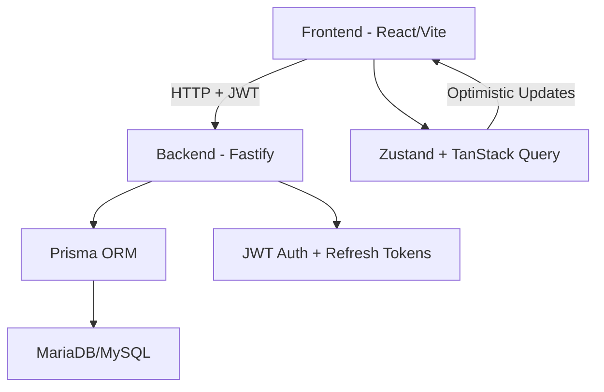

# Orbitra 🚀

A modern **multi-tenant SaaS project management platform** inspired by Trello + Asana + Linear.

Clean Architecture backend (Fastify + Prisma + TypeScript) + React frontend (Vite + shadcn/ui + TanStack Query + dnd-kit).

## Features

- Multi-tenancy (organizations/workspaces)
- Kanban boards with drag & drop (@dnd-kit)
- Task management (status, priority, due dates, assignees, comments)
- JWT + Refresh Token authentication
- Clean Architecture + Domain-Driven Design
- Beautiful UI with shadcn/ui, dark mode, Framer Motion animations
- Real-time feel with TanStack Query optimistic updates
- Command Palette (⌘K), undo actions, Sonner toasts
- Fully Dockerized (one-command dev environment)

## Tech Stack

**Backend**
- Node.js + TypeScript
- Fastify
- Prisma ORM + MariaDB/MySQL
- Zod validation
- JWT auth

**Frontend**
- React 18 + TypeScript
- Vite
- Tailwind CSS + shadcn/ui + Radix UI
- TanStack Query + Zustand
- Framer Motion + @dnd-kit + Recharts + Sonner

**Infra**
- Docker + Docker Compose
- Vitest (integration tests)

## Project Structure

```text
orbitra/
├── backend/          # Fastify API
├── frontend/         # React + Vite app
├── docker-compose.yml
├── .env.example
└── README.md
```

## Quick Start (Docker - Recommended)

```bash
Clone the repo
git clone https://github.com/lucasgabdsant0s/Orbitra.git
cd Orbitra

# Copy env example
cp .env.example .env

# Start everything (db + backend + frontend)
docker compose up -d --build

# Open in browser
http://localhost:5173   # Frontend (Vite dev server)
http://localhost:3333   # Backend API (if you want to test directly)
```
### First login/register → create a tenant → create projects → enjoy the Kanban!

## Development (without Docker)

### Backend:
```Bash
cd backend
npm install
npm run dev
```

### Frontend:
```Bash
cd frontend
npm install
npm run dev
```

## Architecture Overview



## Contributing

Fork the repo
Create feature branch (git checkout -b feature/amazing-kanban)
Commit your changes (git commit -m 'Add amazing feature')
Push to branch (git push origin feature/amazing-kanban)
Open a Pull Request

## License

MIT © 2026 Lucas Gabriel dos Santos
