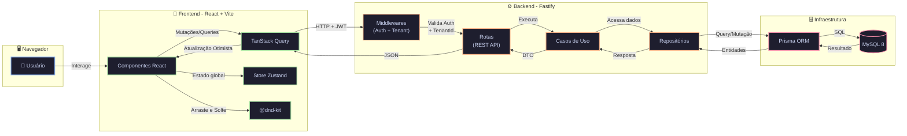

```mermaid
flowchart TD
    Root(("🪐 Orbitra"))

    Backend["⚙️ Backend (Fastify)"]
    Frontend["🎨 Frontend (React)"]
    Docker["🐳 Infraestrutura"]

    Root --> Backend
    Root --> Frontend
    Root --> Docker

    subgraph Backend_Struct ["Lógica do Servidor"]
        direction TB
        B1["🧠 core (Entidades & Interfaces)"]
        B2["📦 application (Casos de Uso)"]
        B3["🔌 infra (Banco de Dados & HTTP)"]
        B4["🧪 testes"]
    end

    subgraph Frontend_Struct ["Aplicação Client"]
        direction TB
        F1["app (Roteamento & Layout)"]
        F2["🎯 features (Auth, Projetos, Tarefas)"]
        F3["🧩 componentes"]
        F4["🌐 traduções (i18n)"]
    end

    subgraph Docker_Struct ["Ambiente & Deploy"]
        direction TB
        D1["compose.dev.yml"]
        D2["compose.prod.yml"]
        D3["docker-compose.test.yml"]
    end

    Backend --> Backend_Struct
    Frontend --> Frontend_Struct
    Docker --> Docker_Struct

    %% Estilização
    classDef default fill:#1e1e2e,stroke:#89b4fa,stroke-width:1px,color:#cdd6f4
    classDef root fill:#7c3aed,stroke:#fff,stroke-width:2px,color:#fff
    classDef backend fill:#3b82f6,stroke:#fff,color:#fff
    classDef frontend fill:#ec4899,stroke:#fff,color:#fff
    classDef docker fill:#06b6d4,stroke:#fff,color:#fff

    class Root root
    class Backend backend
    class Frontend frontend
    class Docker docker
```

<p align="center">
  <h1 align="center">🪐 Orbitra</h1>
</p>

> [!NOTE]
> Esta documentação também está disponível em [Inglês](./README.md).

<p align="center">
  <a href="https://github.com/lucasgabdsant0s/Orbitra/blob/main/LICENSE"></a>
  
  
  
  
  
  
</p>

<p align="center">
  <strong>Uma plataforma SaaS moderna, escalável e multi-tenant para gerenciamento de projetos.</strong>
</p>

<p align="center">
  <em>Quadros Kanban, arraste e solte, modo escuro, Clean Architecture tudo em um só lugar.</em>
</p>

---

## ✨ Funcionalidades

|     | Funcionalidade             | Descrição                                                                      |
| --- | -------------------------- | ------------------------------------------------------------------------------ |
| 🏢  | **Multi-tenancy**          | Organizações e workspaces totalmente isolados com segurança no nível do tenant |
| 📋  | **Quadros Kanban**         | Quadros interativos com arraste e solte fluido via `@dnd-kit`                  |
| ✅  | **Gestão de Tarefas**      | Status, priorização, prazos, responsáveis e comentários                        |
| 🔐  | **Autenticação JWT**       | Login seguro com Access Token + Refresh Token                                  |
| 🏗️  | **Clean Architecture**     | Backend inspirado em DDD com Casos de Uso e Injeção de Dependência             |
| 🎨  | **UI Premium**             | Modo escuro, glassmorphism e animações com Framer Motion                       |
| ⚡  | **Atualizações Otimistas** | Feedback instantâneo na UI com TanStack Query                                  |
| 🌐  | **Internacionalização**    | Suporte completo a i18n (PT-BR / EN)                                           |
| 📊  | **Dashboard de Analytics** | Visão geral com métricas e gráficos                                            |
| 🔔  | **Notificações**           | Sistema de notificações em tempo real                                          |
| 🐳  | **Totalmente Dockerizado** | Ambiente completo configurado com um único comando                             |

---

## 🛠️ Tecnologias

### Backend

`Node.js` • `TypeScript` • `Fastify` • `Prisma ORM` • `MySQL 8` • `Zod` • `JWT` • `Bcrypt` • `Vitest` • `Biome`

### Frontend

`React 19` • `TypeScript` • `Vite` • `Tailwind CSS` • `shadcn/ui` • `Radix UI` • `TanStack Query` • `Zustand` • `Framer Motion` • `@dnd-kit` • `React Hook Form` • `i18next` • `cmdk` • `Sonner` • `Lucide Icons` • `Axios`

### Infraestrutura

`Docker` • `Docker Compose` • `Vitest (unitário + integração)` • `Scalar (documentação da API)`

---

## 📂 Estrutura de Pastas

```text
orbitra/
├── backend/
│   ├── src/
│   │   ├── core/                    # 🧠 Domínio (entidades, interfaces, enums)
│   │   │   ├── entities/            # User, Project, Task, Tenant, Comment...
│   │   │   ├── interfaces/          # Contratos dos repositórios
│   │   │   ├── enums/               # Enumerações de domínio
│   │   │   ├── exceptions/          # Exceções personalizadas
│   │   │   └── types/               # Tipos compartilhados
│   │   ├── application/             # 📦 Casos de Uso
│   │   │   ├── use-cases/           # auth, project, task, tenant, user...
│   │   │   └── dtos/                # Objetos de Transferência de Dados
│   │   ├── infra/                   # 🔌 Implementações concretas
│   │   │   ├── http/                # Servidor Fastify, rotas, middlewares
│   │   │   │   ├── routes/          # Rotas REST organizadas por domínio
│   │   │   │   ├── middlewares/     # Auth, tenant, rate-limit
│   │   │   │   └── schemas/         # Schemas de validação Zod
│   │   │   ├── database/            # Prisma client, schema, repositórios
│   │   │   │   ├── prisma/          # schema.prisma + migrações
│   │   │   │   └── repositories/    # Implementações Prisma dos repositórios
│   │   │   ├── providers/           # Hash, Token, etc.
│   │   │   ├── config/              # Configuração da aplicação
│   │   │   ├── context/             # Contexto da requisição
│   │   │   └── container.ts         # 💉 Container de Injeção de Dependência
│   │   ├── shared/                  # Utilitários compartilhados
│   │   ├── __tests__/               # 🧪 Testes unitários e de integração
│   │   ├── server.ts                # Bootstrap do Fastify
│   │   └── main.ts                  # Ponto de entrada
│   ├── vitest.config.ts             # Configuração de testes unitários
│   ├── vitest.integration.config.ts # Configuração de testes de integração
│   ├── prisma.config.ts
│   └── package.json
│
├── frontend/
│   ├── src/
│   │   ├── app/                     # 🗂️ Rotas e layout principal
│   │   │   ├── router.tsx           # Configuração do React Router
│   │   │   ├── layout.tsx           # Layout principal (Sidebar + Header)
│   │   │   └── routes/              # Páginas baseadas em rotas
│   │   ├── features/                # 🎯 Módulos baseados em funcionalidades
│   │   │   ├── auth/                # Login, Cadastro, AuthGuard
│   │   │   ├── projects/            # CRUD de Projetos
│   │   │   ├── tasks/               # Kanban, CRUD de Tarefas
│   │   │   ├── dashboard/           # Dashboard de Analytics
│   │   │   ├── comments/            # Sistema de comentários
│   │   │   ├── notifications/       # Notificações
│   │   │   ├── tenants/             # Gestão de workspace
│   │   │   └── settings/            # Configurações de usuário
│   │   ├── components/              # 🧩 Componentes reutilizáveis
│   │   │   ├── ui/                  # shadcn/ui (Button, Dialog, Input...)
│   │   │   ├── Sidebar.tsx          # Navegação lateral
│   │   │   ├── Header.tsx           # Cabeçalho com busca + avatar
│   │   │   └── LanguageSwitcher.tsx  # Seletor de idioma
│   │   ├── stores/                  # Stores Zustand (auth, theme)
│   │   ├── providers/               # Provedores de contexto React
│   │   ├── locales/                 # 🌐 Arquivos de tradução (pt, en)
│   │   ├── lib/                     # Cliente Axios, utilitários
│   │   ├── types/                   # Interfaces TypeScript
│   │   └── main.tsx                 # Ponto de entrada
│   ├── vite.config.ts
│   ├── tailwind.config.ts
│   ├── Dockerfile
│   └── package.json
│
├── compose.dev.yml                  # 🐳 Docker Compose (desenvolvimento)
├── compose.prod.yml                 # 🚀 Docker Compose (produção)
├── docker-compose.test.yml          # 🧪 Docker Compose (testes)
├── .env.example                     # Variáveis de ambiente
└── README.md
```



---

## 🔄 Fluxo da Aplicação



---

## 🚀 Como Começar

### Pré-requisitos

- **Node.js** >= 20
- **npm** >= 10
- **Docker** + **Docker Compose** (recomendado)
- **MySQL 8** (se rodar sem Docker)

### 🐳 Com Docker (Recomendado)

```bash
# 1. Clone o repositório
git clone https://github.com/lucasgabdsant0s/Orbitra.git
cd Orbitra

# 2. Copie as variáveis de ambiente
cp .env.example .env

# 3. Inicie tudo (banco de dados + API + frontend)
docker compose -f compose.dev.yml up --build

# 4. Abra no seu navegador
# Frontend → http://localhost:5180
# Backend  → http://localhost:3333/docs
```

### 💻 Sem Docker (Manual)

```bash
# 1. Clone o repositório
git clone https://github.com/lucasgabdsant0s/Orbitra.git
cd Orbitra

# 2. Configure o backend
cd backend
cp .env.example .env.development   # Edite com suas credenciais do MySQL
npm install
npx prisma db push --schema=./src/infra/database/prisma/schema.prisma
npm run dev

# 3. Configure o frontend (em outro terminal)
cd frontend
cp .env.example .env               # Ajuste VITE_API_URL se necessário
npm install
npm run dev
```

---

## ⚡ Início Rápido

```bash
# Após iniciar a aplicação:

# 1. Acesse http://localhost:5180
# 2. Cadastre-se com seu nome, e-mail e senha
# 3. Um tenant (workspace) será criado automaticamente
# 4. Crie seu primeiro projeto
# 5. Adicione tarefas e arraste-as no quadro Kanban! 🎉
```

**Principais endpoints da API:**

```bash
# Autenticação
POST   /api/auth/register
POST   /api/auth/login
POST   /api/auth/refresh

# Projetos
GET    /api/projects
POST   /api/projects
PATCH  /api/projects/:id

# Tarefas
GET    /api/projects/:id/tasks
POST   /api/projects/:id/tasks
PATCH  /api/tasks/:id
```

---

## 🔧 Variáveis de Ambiente

| Variável              | Descrição                         | Obrigatório | Padrão        | Exemplo                             |
| --------------------- | --------------------------------- | ----------- | ------------- | ----------------------------------- |
| `MYSQL_ROOT_PASSWORD` | Senha root do MySQL               | Sim         | —             | `root`                              |
| `MYSQL_DATABASE`      | Nome do banco de dados            | Sim         | —             | `orbitra`                           |
| `MYSQL_USER`          | Usuário do banco de dados         | Sim         | —             | `orbitra_user`                      |
| `MYSQL_PASSWORD`      | Senha do usuário do banco         | Sim         | —             | `orbitra_pass`                      |
| `DATABASE_URL`        | String de conexão completa        | Sim         | —             | `mysql://user:pass@db:3306/orbitra` |
| `PORT`                | Porta da API Backend              | Não         | `3333`        | `3333`                              |
| `JWT_SECRET`          | Chave secreta para tokens JWT     | Sim         | —             | `minha-chave-super-secreta`         |
| `NODE_ENV`            | Ambiente de execução              | Não         | `development` | `production`                        |
| `VITE_API_URL`        | URL da API para o frontend        | Sim         | —             | `http://localhost:3333/api`         |
| `CHOKIDAR_USEPOLLING` | Habilitar polling para hot reload | Não         | `false`       | `true`                              |

---

## 🧪 Testes

```bash
# Testes unitários
cd backend
npm run test

# Testes unitários com watch mode
npm run test:watch

# Testes com cobertura de código
npm run test:coverage

# Testes de integração (sobe um container MySQL automaticamente)
npm run test:integration

# Desliga os containers de teste
npm run test:down
```

---

## 🌐 Deploy

### Opções Recomendadas

| Plataforma  | Serviço         | Camada Gratuita          |
| ----------- | --------------- | ------------------------ |
| **Railway** | Backend + MySQL | Sim (créditos limitados) |
| **Netlify** | Frontend (Vite) | Sim                      |

### Passos para Deploy

#### 🚂 Backend (Railway)

1.  Crie um novo projeto no **Railway**.
2.  Adicione um serviço de banco de dados **MySQL**.
3.  Conecte seu repositório GitHub.
4.  Defina o **Root Directory** como `backend`.
5.  O Railway detectará automaticamente o `Dockerfile` e fará o build.
6.  Adicione as variáveis de ambiente necessárias (o Railway costuma fornecer `MYSQL_URL` automaticamente, que a aplicação já suporta).

#### 🌐 Frontend (Netlify)

1.  Crie um novo site no **Netlify** e conecte seu repositório GitHub.
2.  O Netlify detectará automaticamente o `netlify.toml` na raiz.
3.  Certifique-se de configurar as variáveis em **Site configuration > Environment variables**:
    - `VITE_API_URL`: A URL do seu backend no Railway (ex: `https://seu-backend.up.railway.app/api`).
4.  Acione um deploy e pronto!

---

## 🤝 Contribuindo

Contribuições são muito bem-vindas! 🎉

1. Faça um **Fork** do repositório
2. Crie sua branch de funcionalidade (`git checkout -b feature/minha-funcionalidade`)
3. Commit suas mudanças (`git commit -m 'feat: adiciona funcionalidade incrível'`)
4. Push para a branch (`git push origin feature/minha-funcionalidade`)
5. Abra um **Pull Request**

> [!TIP]
> Use [Conventional Commits](https://www.conventionalcommits.org/) para manter um histórico de commits limpo.

---

## 📄 Licença

Distribuído sob a licença **MIT**. Veja [`LICENSE`](./LICENSE) para mais informações.

**MIT © 2026 Lucas Gabriel dos Santos**

---

<p align="center">
  Feito com 💜 e muito ☕ por <a href="https://github.com/lucasgabdsant0s">Lucas Gabriel</a>
</p>
